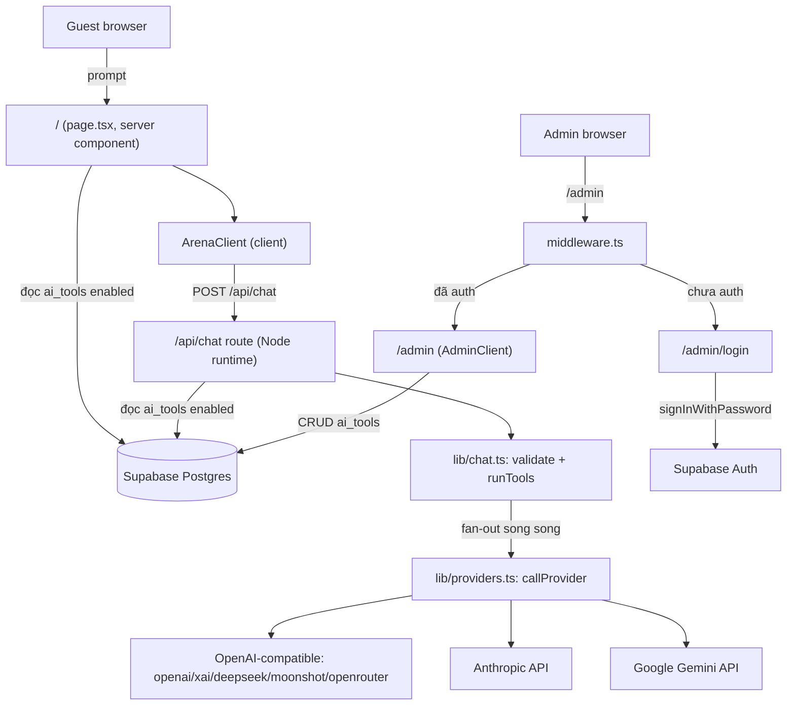
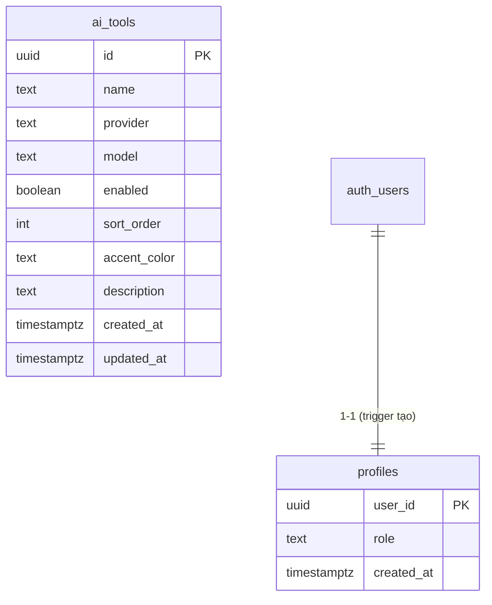
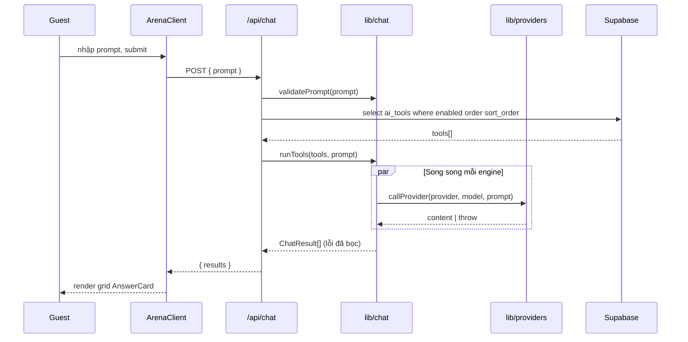

# AI Arena — Technical Specification

> Đặc tả kỹ thuật. Đọc kèm: [requirements.md](./requirements.md), [ai-agent-guide.md](./ai-agent-guide.md).

## 1. Stack công nghệ

| Lớp | Công nghệ |
|-----|-----------|
| Frontend + Backend | Next.js 14 (App Router) + API Routes, TypeScript |
| UI | Tailwind CSS 3 |
| Database + Auth | Supabase (Postgres + Supabase Auth) |
| Supabase SDK | `@supabase/ssr` 0.5.x, `@supabase/supabase-js` 2.45.x |
| Test | Vitest 2.x |
| Deploy | Vercel (Node.js runtime) |

## 2. Kiến trúc tổng thể



## 3. Cấu trúc thư mục

```
src/
├── middleware.ts                 # Next.js middleware entry → updateSession
├── app/
│   ├── page.tsx                  # Guest landing (server, force-dynamic): đọc ai_tools, dedupe theo provider
│   ├── layout.tsx                # Root layout (lang="vi")
│   ├── globals.css               # Tailwind + dark theme
│   ├── admin/
│   │   ├── page.tsx              # Admin dashboard (server, lấy user + tools)
│   │   └── login/page.tsx        # Login form (signInWithPassword)
│   └── api/chat/route.ts         # POST /api/chat — fan-out
├── components/
│   ├── ArenaClient.tsx           # Prompt input + grid kết quả
│   ├── AnswerCard.tsx            # Card 1 engine (spinner/ok/lỗi + elapsed)
│   └── AdminClient.tsx           # CRUD ai_tools (browser Supabase client)
└── lib/
    ├── types.ts                  # Provider, AiTool, ChatResult
    ├── chat.ts                   # validatePrompt, buildToolResult, runTools
    ├── providers.ts              # callProvider + adapters + parsers
    └── supabase/
        ├── client.ts             # createBrowserClient
        ├── server.ts             # createServerClient (cookies)
        ├── middleware.ts         # updateSession + guard /admin
        └── env.ts                # đọc + sanitize env (trim)
supabase/
├── config.toml                   # CLI config (project_id, ports, [db.seed])
├── schema.sql                    # Bản tham chiếu schema (DDL, không seed)
├── seed.sql                      # Seed 6 engine mặc định (idempotent)
└── migrations/
    └── 20260729191304_init.sql   # Migration khởi tạo (chỉ DDL)
```

## 4. Data model

### Bảng `public.ai_tools`

| Cột | Kiểu | Ghi chú |
|-----|------|---------|
| id | uuid PK | `gen_random_uuid()` |
| name | text NOT NULL | Tên hiển thị (ChatGPT, Claude...) |
| provider | text NOT NULL | Khớp union `Provider` trong code |
| model | text NOT NULL | Model id gửi tới API |
| enabled | boolean NOT NULL default true | Bật/tắt trên trang guest |
| sort_order | int NOT NULL default 0 | Thứ tự hiển thị |
| accent_color | text default '#6366f1' | Màu badge (hex) |
| description | text default '' | Mô tả ngắn |
| created_at | timestamptz default now() | |
| updated_at | timestamptz default now() | Trigger `set_updated_at` |

- **Index:** `idx_ai_tools_enabled_sort (enabled, sort_order)` — phục vụ truy vấn chính.
- **Trigger:** `trg_ai_tools_updated_at` gọi `public.set_updated_at()` trước UPDATE.



### Bảng `public.profiles`

| Cột | Kiểu | Ghi chú |
|-----|------|---------|
| user_id | uuid PK | FK → `auth.users(id)` on delete cascade |
| role | text NOT NULL default 'viewer' | `admin` \| `viewer` |
| created_at | timestamptz default now() | |

- Hàm `public.is_admin()` dùng trong RLS `ai_tools`.
- Trigger `on_auth_user_created` tự tạo profile `viewer` khi có user mới.

## 5. API

### `POST /api/chat`
- **Runtime:** `nodejs`, `maxDuration = 60`.
- **Request:** `{ "prompt": string }`.
- **Xử lý:**
  1. `validatePrompt` — trim, không rỗng, ≤ `MAX_PROMPT_LENGTH` (8000). Lỗi → 400.
  2. Đọc `ai_tools` (`enabled = true`, order `sort_order`) qua server Supabase client.
  3. Không có engine nào → 400.
  4. `runTools(tools, prompt)` — fan-out song song.
- **Response:** `{ "results": ChatResult[] }`.

```jsonc
// ChatResult
{
  "toolId": "uuid", "name": "ChatGPT", "provider": "openai",
  "model": "gpt-4o-mini", "accent_color": "#10a37f",
  "ok": true, "content": "…",          // khi thành công
  "error": "HTTP 401: …",              // khi lỗi (ok=false)
  "elapsedMs": 1234
}
```

## 6. Luồng fan-out (sequence)



## 7. Provider layer (`lib/providers.ts`)

- **Union `Provider`:** `openai | anthropic | gemini | xai | deepseek | moonshot | openrouter`.
- **`KEY_ENV`:** map provider → tên biến môi trường chứa API key.
- **OpenAI-compatible** (openai, xai, deepseek, moonshot, openrouter): dùng chung `openAiCompatible()` với `OPENAI_COMPATIBLE_BASE_URLS`. Gửi 2 message (`system` = `SYSTEM_PROMPT`, `user` = prompt), `temperature: 0.7`. OpenRouter thêm headers `OPENROUTER_HEADERS` (`HTTP-Referer`, `X-Title`).
- **Adapter riêng:** `anthropic()` (messages API, `max_tokens: 1024`, `anthropic-version: 2023-06-01`, `system` = `SYSTEM_PROMPT`), `gemini()` (`generateContent`, `systemInstruction` = `SYSTEM_PROMPT`, key truyền qua query `?key=`).
- **`SYSTEM_PROMPT`:** hằng dùng chung cho mọi provider (`"You are a helpful assistant..."`).
- **Parser tách riêng** (`parseOpenAiContent`, `parseAnthropicContent`, `parseGeminiContent`) để unit test không cần network. Mỗi parser throw `"Không có nội dung trả về"` khi thiếu content; lỗi HTTP throw `HTTP <status>: <body 300 ký tự đầu>`.
- **`getApiKey(provider)`:** đọc `process.env[KEY_ENV[provider]]`; thiếu key → throw thông báo nêu tên biến cần đặt (không gọi mạng).
- **`withTimeout`:** `Promise.race` timeout mặc định 60s cho mỗi call (throw `Timeout sau <ms>ms`).

## 8. Bảo mật & RLS

- **API key provider:** chỉ đọc ở server (`process.env`), không bao giờ gửi ra client.
- **Rate limit `/api/chat`:** in-memory theo IP (10 req/60s), trả 429 + `Retry-After` khi vượt. Chống lạm dụng & bảo vệ chi phí API. (Nhiều instance → nên chuyển Upstash Redis.)
- **Giới hạn fan-out:** tối đa `MAX_ENGINES_PER_REQUEST = 8` engine mỗi request (`.limit()`).
- **Thông báo lỗi:** lỗi DB nội bộ được log ở server, client chỉ nhận thông báo chung (không rò rỉ chi tiết).
- **Giới hạn phản hồi:** `max_tokens = 1024` mọi provider (chi phí + độ trễ).
- **Gemini:** `encodeURIComponent(model)` tránh path injection vào URL.
- **RLS trên `ai_tools`:**
  - `public read ai_tools` — `select using (true)` (guest đọc được).
  - `admin write ai_tools` — `for all to authenticated using (public.is_admin())`. **Chỉ user có `profiles.role = 'admin'`** mới ghi được.
- **Phân quyền (`profiles`):** bảng `profiles(user_id, role)` liên kết `auth.users`. Hàm `public.is_admin()` (security definer) kiểm tra role. Trigger `on_auth_user_created` tự tạo profile `viewer` cho user mới. Nâng admin bằng SQL: `update public.profiles set role='admin' where user_id='<uuid>'`.
- **Middleware:** `updateSession` refresh session + chặn `/admin` (trừ `/admin/login`) khi chưa có user.
- **Env sanitize:** `env.ts` `.trim()` URL/anon key tránh lỗi fetch "Invalid value".
- **`.gitignore`:** chặn mọi `.env.*` trừ `.env.example` (tránh lộ key thật).

> Chi tiết review + tối ưu: [security-performance.md](./security-performance.md).

## 9. Cấu hình Supabase (chuẩn hóa)

| Việc | Cách làm |
|------|----------|
| Áp schema (CLI) | `supabase db push` (dùng `migrations/`) |
| Reset + seed local | `supabase db reset` (chạy migrations rồi `seed.sql` theo `[db.seed]`) |
| Khởi tạo nhanh (Dashboard) | Dán `schema.sql` vào SQL Editor, rồi `seed.sql` nếu cần |
| Thêm thay đổi schema | `supabase migration new <name>` → cập nhật `schema.sql` cho khớp |

- **Nguyên tắc:** migrations chỉ chứa **DDL** (idempotent). **Seed tách riêng** ở `seed.sql`. `schema.sql` là bản tham chiếu dễ đọc, không chứa seed.

## 10. Biến môi trường

| Biến | Bắt buộc | Dùng ở |
|------|----------|--------|
| `NEXT_PUBLIC_SUPABASE_URL` | Có | client + server |
| `NEXT_PUBLIC_SUPABASE_ANON_KEY` | Có | client + server |
| `SUPABASE_SERVICE_ROLE_KEY` | Không | (chưa dùng) server-only nếu cần bypass RLS |
| `OPENAI_API_KEY` | Tuỳ engine | provider openai |
| `ANTHROPIC_API_KEY` | Tuỳ engine | provider anthropic |
| `GEMINI_API_KEY` | Tuỳ engine | provider gemini |
| `XAI_API_KEY` | Tuỳ engine | provider xai |
| `DEEPSEEK_API_KEY` | Tuỳ engine | provider deepseek |
| `MOONSHOT_API_KEY` | Tuỳ engine | provider moonshot |
| `OPENROUTER_API_KEY` | Tuỳ engine | provider openrouter |

## 11. Build & Test

```bash
npm install
npm run test     # Vitest (validate/parser/orchestration)
npm run build    # Next.js production build
npm run dev
```
